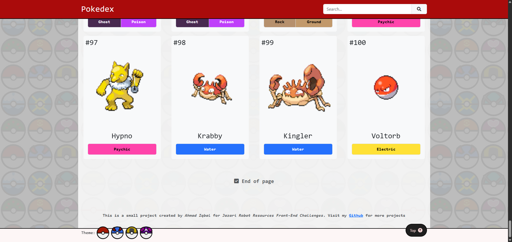

# Mini Pokedex Project

Welcome to my Mini Pokedex Project.

## About

A project created using Vue JS Vite Template. This is a simple Pokedex with minimal functionality. The purpose of this project is to practice Vue Js as well as technical assessment for a job application at Jazari Robot Resources.

The pages are responsive and a mobile-first development approach.

There are two important pages in the project:
1. Main Page
2. Detail Page

### Main Page

Display a list of Pokemon and its simple information in card form.




User can use a search functionality to filter the Pokemon based on their name.


### Detail Page

Display some information such as Name, Abilities, Stats etc. There is also a navigation bar on top for better user navigating experience.

<p>
  
  
  
  
</p>

#### Edit Store

Use Edit Store functionality to temporarily change the data for the current Pokemon page.

<p>
  
</p>

## Themes

There are four predefined themes for this website. Change the theme by clicking on one of the Pokeball on the bottom left side. The themes are:
1. Pokeball

<p>
  
  
</p>

2. Greatball

<p>
  
  
</p>

3. Ultraball

<p>
  
  
</p>

4. Masterball

<p>
  
    
</p>

## Steps to Run Project Locally

Follow the steps to run the project locally. For viewing purposes only, can visit [Published Site](https://bal129.github.io/Jazro-pokedex/).

### Recommended IDE Setup

[VSCode](https://code.visualstudio.com/) + [Volar](https://marketplace.visualstudio.com/items?itemName=Vue.volar) (and disable Vetur).

### Required Installation

Make sure to install [Node](https://nodejs.org/en/download) and [Git](https://git-scm.com/book/en/v2/Getting-Started-Installing-Git)

### Clone Project

```sh
git clone <repository-url>
```

### Navigate to Project Directory

```sh
cd <your-directory>
```

### Project Setup

```sh
npm install
```
Make sure to be in project directory

### Compile and Hot-Reload for Development

```sh
npm run dev
```
Make sure to be in project directory

### Compile and Minify for Production

```sh
npm run build
```
Make sure to be in project directory